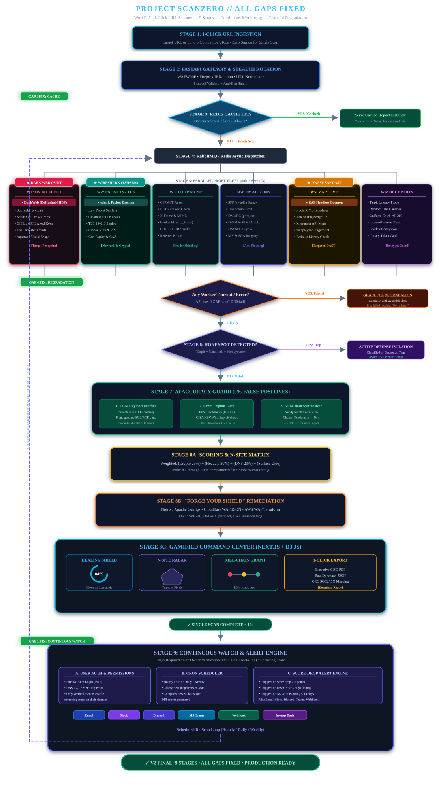

# ⚡ ScanZero

## Scan Smarter. Compare Better. Understand Every Score.

ScanZero analyzes websites across multiple security and performance dimensions with 55+ automated tools across 6 parallel workers, providing AI-verified findings, clear plain-English score explanations, competitor comparisons, and copy-paste remediation guidance.

### Features
- 🔍 **OSINT & Dark Web** — Subdomain enum, Shodan, HIBP breach checks
- 🔒 **TLS & Network** — tshark packet capture, SSLyze deep TLS analysis
- 🛡️ **HTTP Headers** — CSP parsing, HSTS preload, cookie security
- 📧 **DNS & Email** — SPF/DMARC/DKIM/DNSSEC validation
- ⚡ **Active DAST** — OWASP ZAP, Nuclei CVE scanning
- 🕵️ **Honeypot Detection** — Distinguishes real vulns from deception traps
- 🤖 **AI Accuracy Guard** — LLM + EPSS false positive elimination
- 📊 **Gamified Dashboard** — Healing Shield, Radar Chart, Kill-Chain Graph
- 🔄 **Continuous Monitoring** — Login-gated hourly/daily re-scans with alerts

---

## Quick Start

### 1. Clone & Configure
```bash
cd d:\self_project\scanzero
copy .env.example .env
# Edit .env and add your API keys
```

### 2. Start with Docker
```bash
docker-compose up --build
```

### 3. Open in Browser
- **Frontend:** http://localhost:3000
- **Backend API:** http://localhost:8000/docs
- **Scan:** Enter any URL and click SCAN!

### 4. (Optional) Start OWASP ZAP
```bash
docker-compose --profile full up
```

---

## API Keys (Free Tiers)

| Service | Free Tier | Get Key |
|:---|:---|:---|
| Shodan | 100 queries/month | https://account.shodan.io |
| HIBP | $3.50/month | https://haveibeenpwned.com/API/Key |
| Censys | 250 queries/month | https://search.censys.io |
| Google Gemini | 60 req/min | https://ai.google.dev |

---

## Tech Stack

| Layer | Technology |
|:---|:---|
| Backend | Python 3.11, FastAPI, SQLAlchemy, Celery |
| Frontend | Next.js 14, React, Tailwind CSS, Recharts |
| Database | PostgreSQL 16, Redis 7 |
| Scanner | SSLyze, dnspython, Shodan, ZAP, Nuclei |
| AI | Google Gemini API, EPSS, CISA KEV |
| Deploy | Docker Compose |

---

## Architecture



> 📊 For an interactive deep dive into all scanning stages and decision gates, open [`docs/scanzero_master_flowchart.html`](docs/scanzero_master_flowchart.html) in your browser.

```
URL Input → WAFW00F → Redis Cache → Async Dispatcher
                                          │
                    ┌──────┬──────┬───────┼───────┬──────┐
                   W1     W2     W3      W4      W5     W6
                 OSINT   TLS   HTTP    DNS    DAST  Honeypot
                    └──────┴──────┴───────┼───────┴──────┘
                                          │
                              Error Handling Gate
                                          │
                              Honeypot Decision
                                          │
                              AI Accuracy Guard
                                          │
                           Scoring → Remediation → Dashboard
                                          │
                              Continuous Watch Loop
```

---

## 🚀 Deployment Options

### Option A: 1-Click Cloud VPS Deployment (Docker Compose)
Deploy anywhere with Docker (AWS EC2, DigitalOcean Droplet, Hetzner, Linode):

1. **Clone the repository:**
   ```bash
   git clone https://github.com/<your-username>/scanzero.git
   cd scanzero
   ```
2. **Configure production environment:**
   ```bash
   cp .env.example .env
   # Update SECRET_KEY, GEMINI_API_KEY, SHODAN_API_KEY, NEXT_PUBLIC_API_URL
   ```
3. **Launch all services in detached mode:**
   ```bash
   docker-compose up -d --build
   ```

### Option B: Split Cloud Deployment (Vercel + Render/Railway)
- **Frontend (Next.js):** Deploy to [Vercel](https://vercel.com).
  - Set Environment Variable: `NEXT_PUBLIC_API_URL=https://your-backend-api.onrender.com`
- **Backend (FastAPI + Workers):** Deploy to [Render](https://render.com) or [Railway](https://railway.app).
  - Use `backend/Dockerfile` with PostgreSQL and Redis managed instances.
  - Set environment variables matching `.env.example`.

---

Built with ❤️ for cybersecurity.

